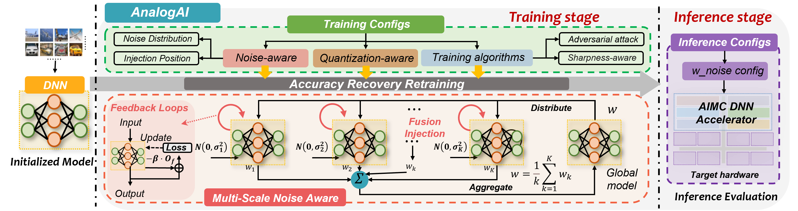
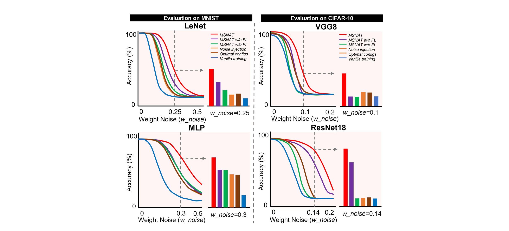

# AnalogAI: A General Accuracy Recovery Framework for Improving the Robustness of DNN
# Overview
Analog in memory Computing (AIMC) is a promising method for accelerating deep neural networks (DNNs) and
reducing energy consumption. However, instabilities caused by
manufacturing and device variations limit its accuracy and
reliability. To cope with complex patterns of realistic noise
behavior and to build a unified framework that leverages the
strengths of various algorithms, we
introduce **AnalogAI**, a new open-source framework designed to
flexibly recover accuracy in analog DNNs. This framework is
centered on a multi-scale noise-aware training approach. The
multi-noise fusion injection (FI) strategy working with multiple
feedback loops (FL) is designed to achieve multi-scale noise
awareness by aggregating distributed weights while improving
training stability. Additionally, the framework enables the design
of custom quantization-aware and supports a range of noise-
insensitive training algorithms for fast accuracy recovery studies.

# Usage
We provide one example to illustrate the usage of the code. For instance, we run resent18 on cifar-10 with 5 level multi-scale noise injection with feedback loops (parameters can be modified in config).

```bash
bash ./script/train_fedprox.sh
```
## Configurations
The retraining configurations can be convently configured at /exp. The important config options are:
```
training.batch_size=256 # training batch size
training.use_fl=True # if True uses multi-noise fusion injection
training.use_neg=True # if True uses multiple feedback loops

recovery.noise_0.act_inject.sigma=0.1 # Range of multi-noise intensities
...
recovery.noise_k.act_inject.sigma=0.3 

recovery.optimizer.sam=false # if True uses sharpness-aware minimization (SAM)
recovery.optimizer.adaptive=false # if True uses adaptive SAM
recovery.adversarial.FGSM.use=false # if True uses the fast gradient sign method for training
recovery.adversarial.PGD.use=false # if True uses projected gradient descent for training
recovery.qat=True # if True uses quantization-aware training (QAT)
```
## Analog Inference
You can run the experiments on an open-source memristor simulation platform (IBM-aihwkit) with state-of-the-art statistical models of phase-change memory (PCM) arrays. we provide a simple example for inference.
```bash
bash ./script/inference.sh
```
The inference config options are:
```
inference.platform.aihwkit=True # if True uses projected gradient descent for inference
inference.platform.aihwkit.device='PCM' # choose the device type of hardware arrays
inference.platform.aihwkit.n_w=0.2 # the w_noise applied for each MAC computation during inference
```

# Accuracy Improvements
Our proposed multi-scale noise-aware training **(MSNAT)** improves the accuracy compare to vanilla training, single noise injection, MSNAT  without (w/o) fusion injection (FI) strategy and multiple feedback loops (FL).

  </div>

# Citation
# License
